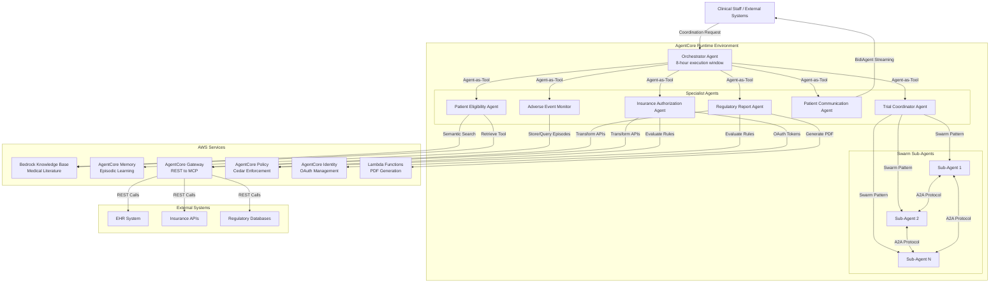

# Design Document: MedFlow Clinical Trial Coordination System

## Overview

MedFlow is a multi-agent AI system for clinical trial and patient care coordination built on AWS AgentCore Runtime and the Strands framework. The system addresses fragmented workflows in hospital environments by orchestrating seven specialized agents that handle patient screening, adverse event monitoring, regulatory reporting, insurance authorization, patient communication, and trial coordination.

### System Goals

1. **Autonomous Workflow Management**: Eliminate manual coordination between clinical trial systems through intelligent agent orchestration
2. **Evidence-Based Decision Making**: Integrate medical literature and historical patterns to support clinical decisions
3. **Real-Time Patient Safety**: Continuously monitor for adverse events with pattern learning and immediate alerting
4. **Regulatory Compliance**: Automatically generate FDA/EMA-compliant reports with complete audit trails
5. **Scalable Coordination**: Handle multiple patients simultaneously through parallel agent execution

### Key Design Principles

- **Agent Specialization**: Each agent has a focused domain responsibility with clear interfaces
- **Composable Patterns**: Leverage Strands patterns (Agent-as-Tool, BidiAgent, Swarm) for different coordination needs
- **Long-Running Execution**: Support complex workflows spanning hours through AgentCore Runtime's 8-hour execution windows
- **Policy-First Security**: Enforce authorization at every tool call using Cedar policies derived from natural language rules
- **Episodic Learning**: Build institutional knowledge through AgentCore Memory for pattern recognition

## Architecture

### High-Level Architecture

The system follows a hierarchical multi-agent architecture with the Orchestrator Agent at the top level delegating to six specialist agents. All agents execute on AWS AgentCore Runtime and communicate through standardized protocols.



### Agent Roles and Responsibilities


**Orchestrator Agent**
- Receives high-level coordination requests from clinical staff
- Parses requests to identify required specialist agents
- Delegates tasks using Agent-as-Tool pattern from Strands
- Aggregates results from specialist agents
- Handles failure recovery and escalation
- Executes on AgentCore Runtime with 8-hour execution windows

**Patient Eligibility Agent**
- Screens patients against clinical trial inclusion/exclusion criteria
- Queries Bedrock Knowledge Base for trial protocols
- Uses semantic search to find supporting medical literature
- Generates eligibility reports with evidence citations
- Compares patient data against each criterion systematically

**Adverse Event Monitor**
- Continuously monitors patient symptoms during trial enrollment
- Evaluates symptoms against known adverse drug reaction patterns
- Uses AgentCore Memory for episodic learning across patient profiles
- Calculates severity grades (1-5) for detected events
- Generates immediate alerts for grade-3+ adverse events
- Retrieves similar historical cases within 500ms for pattern matching

**Regulatory Report Agent**
- Generates FDA/EMA-compliant regulatory reports
- Identifies required format based on regulatory body (FDA 21 CFR Part 312, EMA ICH-GCP)
- Uses AgentCore Gateway to access internal document APIs
- Invokes Lambda functions for PDF generation
- Validates report completeness before finalization
- Requests human input for missing required data

**Insurance Authorization Agent**
- Processes insurance authorization requests for procedures
- Evaluates authorization rules using AgentCore Policy
- Auto-approves requests under $500
- Routes $500-$5000 requests to supervisor review
- Escalates $5000+ requests to human decision-makers
- Authenticates with insurance APIs via AgentCore Identity OAuth
- Enforces Cedar policies at every tool call

**Patient Communication Agent**
- Conducts voice check-ins with patients
- Uses Strands BidiAgent with bidirectional streaming
- Leverages Amazon Nova Sonic for speech-to-text and text-to-speech
- Supports natural interruptions during conversation
- Asks standardized questions about symptoms and medication adherence
- Escalates concerning symptoms to Adverse Event Monitor
- Generates structured conversation summaries within 30 seconds

**Trial Coordinator Agent**
- Schedules multiple patients simultaneously without conflicts
- Uses Strands Swarm Pattern to spawn parallel sub-agents
- Creates one sub-agent per patient requiring coordination
- Enables sub-agent communication via A2A Protocol
- Coordinates time slot negotiations between sub-agents
- Consolidates results into unified conflict-free schedule
- Manages resource limits and queuing for concurrent execution

### Communication Patterns

**Agent-as-Tool Pattern** (Orchestrator → Specialist Agents)
- Orchestrator invokes specialist agents as synchronous tool calls
- Specialist agent executes and returns structured result
- Used for sequential workflows where orchestrator needs results before proceeding

**Swarm Pattern** (Trial Coordinator → Sub-Agents)
- Parent agent spawns multiple child agents for parallel execution
- Sub-agents communicate peer-to-peer via A2A Protocol
- Used for parallel coordination tasks (multi-patient scheduling)
- Parent consolidates results when all sub-agents complete

**BidiAgent Pattern** (Patient Communication Agent)
- Bidirectional streaming for real-time voice conversations
- Supports interruptions and context maintenance
- Used for interactive patient interactions requiring low latency

**A2A Protocol** (Sub-Agent Communication)
- Direct agent-to-agent messaging without central coordination
- Message types: request, response, notification, broadcast
- Guarantees message ordering between same sender-receiver pairs
- 500ms delivery latency for coordination messages

### Implementation Strategy and Build Order

The system should be built incrementally to manage complexity and enable early testing. The build order prioritizes foundational components, then adds specialist agents in order of dependency and complexity.

**Phase 1: Foundation (Weeks 1-2)**
1. Set up AWS AgentCore Runtime environment and IAM roles
2. Configure AgentCore Gateway for REST API transformation
3. Implement basic Orchestrator Agent with Agent-as-Tool pattern
4. Create mock specialist agents for integration testing
5. Establish logging and audit infrastructure

**Phase 2: Core Specialist Agents (Weeks 3-5)**
6. Implement Patient Eligibility Agent with Bedrock Knowledge Base integration
7. Implement Regulatory Report Agent with Lambda PDF generation
8. Implement Insurance Authorization Agent with AgentCore Policy and Identity
9. Test orchestration flows with real specialist agents

**Phase 3: Advanced Monitoring (Weeks 6-7)**
10. Implement Adverse Event Monitor with AgentCore Memory
11. Integrate episodic learning and pattern recognition
12. Connect Patient Communication Agent escalation to Adverse Event Monitor
13. Test end-to-end adverse event detection and alerting

**Phase 4: Interactive Communication (Weeks 8-9)**
14. Implement Patient Communication Agent with BidiAgent pattern
15. Integrate Amazon Nova Sonic for speech processing
16. Test bidirectional streaming and interruption handling
17. Validate conversation summary generation

**Phase 5: Parallel Coordination (Weeks 10-12)**
18. Implement Trial Coordinator Agent with Swarm Pattern
19. Develop A2A Protocol communication between sub-agents
20. Implement resource management and queuing
21. Test multi-patient scheduling with conflict resolution

**Phase 6: Integration and Hardening (Weeks 13-14)**
22. End-to-end integration testing across all agents
23. Performance optimization and latency tuning
24. Security audit and policy validation
25. Documentation and deployment procedures

**Rationale for Build Order:**
- Foundation first ensures all agents have runtime environment and gateway access
- Patient Eligibility and Regulatory Report are independent and can be built in parallel
- Insurance Authorization requires Policy and Identity, built after Gateway is stable
- Adverse Event Monitor depends on Memory service and benefits from having other agents operational for testing
- Patient Communication Agent is complex (bidirectional streaming) and benefits from mature infrastructure
- Trial Coordinator is most complex (swarm coordination) and should be built last when patterns are proven
- Each phase delivers testable functionality and reduces integration risk


## Components and Interfaces

### Orchestrator Agent

**Execution Environment:**
- AWS AgentCore Runtime with 8-hour execution window
- Strands framework for Agent-as-Tool pattern

**Input Interface:**
```typescript
interface CoordinationRequest {
  requestId: string;
  requestType: 'patient_screening' | 'adverse_event_check' | 'regulatory_report' | 
                'insurance_auth' | 'patient_checkin' | 'trial_scheduling';
  priority: 'low' | 'medium' | 'high' | 'urgent';
  payload: Record<string, any>;
  requester: {
    userId: string;
    role: string;
    timestamp: string;
  };
}
```

**Output Interface:**
```typescript
interface CoordinationResponse {
  requestId: string;
  status: 'completed' | 'partial' | 'failed' | 'escalated';
  results: Array<{
    agentName: string;
    agentResult: any;
    executionTime: number;
  }>;
  errors?: Array<{
    agentName: string;
    errorMessage: string;
    retryAttempts: number;
  }>;
  escalationReason?: string;
}
```

**Tool Invocations:**
- `invoke_patient_eligibility_agent(patientId, trialId)`
- `invoke_adverse_event_monitor(patientId, symptoms)`
- `invoke_regulatory_report_agent(reportType, trialId, dateRange)`
- `invoke_insurance_authorization_agent(procedureCode, cost, patientId)`
- `invoke_patient_communication_agent(patientId, checkInType)`
- `invoke_trial_coordinator_agent(patientIds, schedulingConstraints)`

### Patient Eligibility Agent

**Input Interface:**
```typescript
interface EligibilityRequest {
  patientId: string;
  trialId: string;
  requestTimestamp: string;
}
```

**Output Interface:**
```typescript
interface EligibilityResponse {
  patientId: string;
  trialId: string;
  overallEligibility: 'eligible' | 'ineligible' | 'conditional';
  criteriaEvaluations: Array<{
    criterionId: string;
    criterionText: string;
    result: 'pass' | 'fail' | 'unknown';
    reasoning: string;
    citations: Array<{
      documentId: string;
      title: string;
      pageNumber?: number;
      relevanceScore: number;
    }>;
  }>;
  generatedAt: string;
}
```

**Dependencies:**
- Bedrock Knowledge Base (trial protocols, medical literature)
- Strands retrieve tool for semantic search
- AgentCore Gateway for EHR API access

### Adverse Event Monitor

**Input Interface:**
```typescript
interface AdverseEventCheckRequest {
  patientId: string;
  symptoms: Array<{
    symptomCode: string;
    description: string;
    onsetDate: string;
    severity: string;
  }>;
  currentMedications: string[];
  patientProfile: {
    age: number;
    gender: string;
    comorbidities: string[];
  };
}
```

**Output Interface:**
```typescript
interface AdverseEventResponse {
  patientId: string;
  detectedEvents: Array<{
    eventId: string;
    eventType: string;
    severityGrade: 1 | 2 | 3 | 4 | 5;
    confidence: number;
    relatedSymptoms: string[];
    similarHistoricalCases: Array<{
      caseId: string;
      similarity: number;
      outcome: string;
    }>;
  }>;
  alertGenerated: boolean;
  alertLevel?: 'immediate' | 'routine';
  recommendedActions: string[];
}
```

**Dependencies:**
- AgentCore Memory for episodic storage and retrieval
- Pattern recognition algorithms for severity calculation
- Alert notification system for grade-3+ events

### Regulatory Report Agent

**Input Interface:**
```typescript
interface RegulatoryReportRequest {
  reportType: 'IND_Safety' | 'IND_Annual' | 'NDA_Submission' | 'EMA_IMPD';
  trialId: string;
  dateRange: {
    startDate: string;
    endDate: string;
  };
  regulatoryBody: 'FDA' | 'EMA';
}
```

**Output Interface:**
```typescript
interface RegulatoryReportResponse {
  reportId: string;
  reportType: string;
  pdfUrl: string;
  completenessStatus: 'complete' | 'incomplete';
  missingElements?: Array<{
    sectionName: string;
    requiredField: string;
    reason: string;
  }>;
  generatedAt: string;
  validationErrors: string[];
}
```

**Dependencies:**
- AgentCore Gateway for internal document APIs
- Lambda functions for PDF generation
- External regulatory database APIs
- AgentCore Policy for access control

### Insurance Authorization Agent

**Input Interface:**
```typescript
interface AuthorizationRequest {
  patientId: string;
  procedureCode: string;
  procedureDescription: string;
  estimatedCost: number;
  urgency: 'routine' | 'urgent' | 'emergency';
  insuranceProvider: string;
}
```

**Output Interface:**
```typescript
interface AuthorizationResponse {
  authorizationId: string;
  decision: 'auto_approved' | 'supervisor_review' | 'human_escalation' | 'denied';
  approvalAmount?: number;
  routingDestination?: string;
  policyEvaluations: Array<{
    policyId: string;
    policyRule: string;
    evaluation: 'allow' | 'deny';
  }>;
  externalApiCalls: Array<{
    provider: string;
    status: 'success' | 'failed';
    responseTime: number;
  }>;
}
```

**Dependencies:**
- AgentCore Policy for rule evaluation (Cedar policies)
- AgentCore Identity for OAuth token management
- AgentCore Gateway for insurance provider APIs

### Patient Communication Agent

**Input Interface:**
```typescript
interface PatientCheckInRequest {
  patientId: string;
  phoneNumber: string;
  checkInType: 'routine' | 'post_procedure' | 'adverse_event_followup';
  scheduledQuestions: string[];
}
```

**Output Interface:**
```typescript
interface PatientCheckInResponse {
  patientId: string;
  callDuration: number;
  conversationSummary: {
    symptomsReported: string[];
    medicationAdherence: 'compliant' | 'partial' | 'non_compliant';
    concernsRaised: string[];
    escalationTriggered: boolean;
  };
  transcript: string;
  audioRecordingUrl?: string;
  generatedAt: string;
}
```

**Dependencies:**
- AgentCore Runtime with bidirectional streaming support
- Strands BidiAgent pattern
- Amazon Nova Sonic for speech processing
- Adverse Event Monitor for escalation

### Trial Coordinator Agent

**Input Interface:**
```typescript
interface TrialSchedulingRequest {
  patientIds: string[];
  schedulingWindow: {
    startDate: string;
    endDate: string;
  };
  resourceConstraints: {
    maxConcurrentAppointments: number;
    availableRooms: string[];
    staffAvailability: Record<string, string[]>;
  };
  maxConcurrentSubAgents: number;
}
```

**Output Interface:**
```typescript
interface TrialSchedulingResponse {
  scheduleId: string;
  patientSchedules: Array<{
    patientId: string;
    appointmentTime: string;
    assignedRoom: string;
    assignedStaff: string[];
    status: 'scheduled' | 'conflict' | 'failed';
  }>;
  conflictsResolved: number;
  totalNegotiationRounds: number;
  executionMetrics: {
    totalSubAgents: number;
    peakConcurrency: number;
    totalExecutionTime: number;
  };
}
```

**Dependencies:**
- Strands Swarm Pattern for sub-agent spawning
- A2A Protocol for inter-agent communication
- Resource management for concurrency control


## Data Models

### Patient Record

```typescript
interface PatientRecord {
  patientId: string;
  demographics: {
    age: number;
    gender: 'M' | 'F' | 'Other';
    ethnicity?: string;
  };
  medicalHistory: {
    diagnoses: Array<{
      icd10Code: string;
      description: string;
      diagnosisDate: string;
    }>;
    allergies: string[];
    comorbidities: string[];
  };
  currentMedications: Array<{
    drugName: string;
    dosage: string;
    frequency: string;
    startDate: string;
  }>;
  vitalSigns: {
    bloodPressure?: string;
    heartRate?: number;
    temperature?: number;
    lastUpdated: string;
  };
  labResults: Array<{
    testName: string;
    value: number;
    unit: string;
    referenceRange: string;
    testDate: string;
  }>;
}
```

### Clinical Trial Protocol

```typescript
interface ClinicalTrialProtocol {
  trialId: string;
  trialName: string;
  phase: 'Phase_I' | 'Phase_II' | 'Phase_III' | 'Phase_IV';
  sponsor: string;
  inclusionCriteria: Array<{
    criterionId: string;
    criterionText: string;
    category: 'demographic' | 'medical' | 'laboratory' | 'behavioral';
  }>;
  exclusionCriteria: Array<{
    criterionId: string;
    criterionText: string;
    category: 'demographic' | 'medical' | 'laboratory' | 'behavioral';
  }>;
  interventions: Array<{
    type: 'drug' | 'device' | 'procedure';
    name: string;
    description: string;
  }>;
  primaryEndpoints: string[];
  secondaryEndpoints: string[];
  estimatedDuration: number; // days
}
```

### Adverse Event Episode (AgentCore Memory)

```typescript
interface AdverseEventEpisode {
  episodeId: string;
  patientProfile: {
    ageRange: string; // e.g., "45-50" for privacy
    gender: string;
    comorbidityCount: number;
    comorbidityTypes: string[];
  };
  symptoms: Array<{
    symptomCode: string;
    description: string;
    onsetDay: number; // relative to treatment start
    severity: string;
  }>;
  medications: Array<{
    drugClass: string; // generalized for pattern matching
    dosageLevel: 'low' | 'medium' | 'high';
  }>;
  outcome: {
    severityGrade: 1 | 2 | 3 | 4 | 5;
    resolved: boolean;
    interventionRequired: boolean;
    timeToResolution?: number; // days
  };
  embedding: number[]; // vector embedding for semantic similarity
  recordedAt: string;
}
```

### Regulatory Report Document

```typescript
interface RegulatoryReportDocument {
  reportId: string;
  reportType: string;
  regulatoryBody: 'FDA' | 'EMA';
  trialId: string;
  sections: Array<{
    sectionNumber: string;
    sectionTitle: string;
    content: string;
    requiredByRegulation: boolean;
    complete: boolean;
  }>;
  metadata: {
    generatedBy: string; // agent identifier
    generatedAt: string;
    version: string;
    approvalStatus: 'draft' | 'pending_review' | 'approved';
  };
  attachments: Array<{
    attachmentId: string;
    fileName: string;
    fileType: string;
    s3Url: string;
  }>;
}
```

### Authorization Policy (Cedar Format)

```typescript
interface AuthorizationPolicy {
  policyId: string;
  naturalLanguageRule: string;
  cedarPolicy: string; // auto-generated by AgentCore Policy
  applicableAgents: string[];
  applicableTools: string[];
  conditions: Array<{
    attribute: string;
    operator: 'equals' | 'greater_than' | 'less_than' | 'in_range';
    value: any;
  }>;
  effect: 'allow' | 'deny';
  priority: number;
}
```

### Agent Execution Log

```typescript
interface AgentExecutionLog {
  executionId: string;
  agentName: string;
  startTime: string;
  endTime?: string;
  status: 'running' | 'completed' | 'failed' | 'escalated';
  inputPayload: any;
  outputPayload?: any;
  toolInvocations: Array<{
    toolName: string;
    parameters: Record<string, any>;
    result: any;
    executionTime: number;
    policyEvaluations: Array<{
      policyId: string;
      decision: 'allow' | 'deny';
    }>;
  }>;
  errors: Array<{
    timestamp: string;
    errorType: string;
    errorMessage: string;
    stackTrace?: string;
  }>;
  checkpoints: Array<{
    checkpointId: string;
    timestamp: string;
    state: any;
  }>;
}
```

### A2A Protocol Message

```typescript
interface A2AMessage {
  messageId: string;
  messageType: 'request' | 'response' | 'notification' | 'broadcast';
  senderId: string; // agent identifier
  recipientId?: string; // null for broadcast
  swarmId: string;
  payload: any;
  timestamp: string;
  sequenceNumber: number; // for ordering guarantees
  requiresAcknowledgment: boolean;
}
```

### AWS Service Configurations

**AgentCore Runtime Configuration:**
```yaml
runtime:
  execution_window: 28800  # 8 hours in seconds
  checkpoint_interval: 300  # 5 minutes
  max_memory: 10GB
  timeout_behavior: checkpoint_and_resume
  logging:
    level: INFO
    destinations:
      - cloudwatch_logs
      - s3_archive
  bidirectional_streaming:
    enabled: true
    max_concurrent_streams: 10
```

**Bedrock Knowledge Base Configuration:**
```yaml
knowledge_base:
  name: medflow-medical-literature
  embedding_model: amazon.titan-embed-text-v2
  vector_store: opensearch_serverless
  data_sources:
    - type: s3
      bucket: medflow-trial-protocols
      sync_schedule: daily
    - type: s3
      bucket: medflow-medical-journals
      sync_schedule: weekly
  chunking_strategy:
    type: semantic
    max_tokens: 512
    overlap_tokens: 50
  retrieval_configuration:
    top_k: 5
    similarity_threshold: 0.7
```

**AgentCore Memory Configuration:**
```yaml
memory:
  name: medflow-adverse-events
  storage_type: episodic
  embedding_model: amazon.titan-embed-text-v2
  vector_store: opensearch_serverless
  retention_policy:
    duration: 7_years  # FDA requirement
    archival_tier: glacier
  similarity_search:
    algorithm: cosine_similarity
    max_results: 10
    latency_target: 500ms
  learning_configuration:
    pattern_update_frequency: daily
    confidence_threshold: 0.8
```

**AgentCore Gateway Configuration:**
```yaml
gateway:
  name: medflow-api-gateway
  transformations:
    - source_api:
        name: hospital-ehr-api
        base_url: https://ehr.hospital.internal
        auth_type: api_key
      mcp_tools:
        - tool_name: get_patient_record
          http_method: GET
          endpoint: /api/v1/patients/{patientId}
          parameters:
            - name: patientId
              type: string
              required: true
        - tool_name: get_lab_results
          http_method: GET
          endpoint: /api/v1/patients/{patientId}/labs
    - source_api:
        name: insurance-provider-api
        base_url: https://api.insurance-provider.com
        auth_type: oauth2
      mcp_tools:
        - tool_name: submit_authorization_request
          http_method: POST
          endpoint: /v2/authorizations
          parameters:
            - name: procedureCode
              type: string
            - name: patientId
              type: string
            - name: estimatedCost
              type: number
```

**AgentCore Policy Configuration:**
```yaml
policy:
  name: medflow-authorization-policies
  policy_store: cedar
  natural_language_rules:
    - rule_id: auto_approve_low_cost
      rule_text: "Automatically approve any procedure under $500"
      applicable_agents:
        - insurance_authorization_agent
    - rule_id: supervisor_review_medium_cost
      rule_text: "Route procedures between $500 and $5000 to supervisor review"
      applicable_agents:
        - insurance_authorization_agent
    - rule_id: human_escalation_high_cost
      rule_text: "Escalate procedures over $5000 to human decision-maker"
      applicable_agents:
        - insurance_authorization_agent
  enforcement:
    mode: strict
    evaluation_timeout: 100ms
    default_decision: deny
```

**AgentCore Identity Configuration:**
```yaml
identity:
  name: medflow-oauth-manager
  oauth_providers:
    - provider_id: insurance_provider_a
      authorization_endpoint: https://auth.provider-a.com/oauth/authorize
      token_endpoint: https://auth.provider-a.com/oauth/token
      client_id: ${INSURANCE_PROVIDER_A_CLIENT_ID}
      client_secret: ${INSURANCE_PROVIDER_A_CLIENT_SECRET}
      scopes:
        - authorization.read
        - authorization.write
    - provider_id: regulatory_database
      authorization_endpoint: https://fda-api.gov/oauth/authorize
      token_endpoint: https://fda-api.gov/oauth/token
      client_id: ${FDA_API_CLIENT_ID}
      client_secret: ${FDA_API_CLIENT_SECRET}
      scopes:
        - reports.read
  token_management:
    refresh_before_expiry: 300  # 5 minutes
    max_retry_attempts: 3
    cache_tokens: true
```

**Lambda Function Configuration (PDF Generation):**
```yaml
lambda:
  function_name: medflow-pdf-generator
  runtime: python3.11
  memory: 3008MB
  timeout: 30s
  environment_variables:
    REPORT_TEMPLATES_BUCKET: medflow-report-templates
    OUTPUT_BUCKET: medflow-generated-reports
  layers:
    - reportlab-layer
    - pillow-layer
  concurrency:
    reserved: 10
    provisioned: 2
```


## Correctness Properties

A property is a characteristic or behavior that should hold true across all valid executions of a system—essentially, a formal statement about what the system should do. Properties serve as the bridge between human-readable specifications and machine-verifiable correctness guarantees.

### Property Reflection

After analyzing all acceptance criteria, I identified the following redundancies and consolidations:

- Properties 5.3, 5.4, 5.5 (cost-based routing) can be combined into a single comprehensive property about authorization routing based on cost thresholds
- Properties 18.2 and 18.3 (retry and escalation) can be combined into a single property about retry-then-escalate behavior
- Properties 15.5 and 5.9 (retry behavior) follow the same pattern and can use a shared testing approach
- Properties 19.1 and 19.2 (audit logging) can be combined into a comprehensive logging property
- Properties 7.6 and 7.7 (schedule consolidation and conflict-free) are related but test different aspects, so both are kept

### Property 1: Orchestrator Request Routing

For any coordination request, the Orchestrator Agent should identify the correct set of specialist agents based on the request type.

**Validates: Requirements 1.1**

### Property 2: Orchestrator Result Aggregation

For any set of specialist agent results, the Orchestrator Agent should determine appropriate next actions based on the combined results.

**Validates: Requirements 1.4**

### Property 3: Orchestrator Failure Handling

For any specialist agent failure, the Orchestrator Agent should log the failure with error details and attempt recovery or escalation.

**Validates: Requirements 1.5, 18.1**

### Property 4: Eligibility Criteria Completeness

For any patient eligibility evaluation, the generated report should contain a pass/fail status for each criterion in the trial protocol.

**Validates: Requirements 2.4, 2.5**

### Property 5: Eligibility Report Citations

For any eligibility report, all eligibility determinations should include citations from medical literature with document identifiers and page numbers.

**Validates: Requirements 2.6, 8.5**

### Property 6: Adverse Event Severity Range

For any detected adverse event pattern, the calculated severity grade should be in the range 1 to 5 (inclusive).

**Validates: Requirements 3.4**

### Property 7: High-Severity Alert Generation

For any adverse event with severity grade 3 or higher, the Adverse Event Monitor should generate an immediate alert.

**Validates: Requirements 3.5**

### Property 8: Adverse Event Memory Storage

For any adverse event stored in episodic memory, the record should include patient profile, symptoms, timeline, and outcome.

**Validates: Requirements 13.2**

### Property 9: Historical Case Retrieval

For any new adverse event evaluation, the Adverse Event Monitor should retrieve similar historical cases from memory.

**Validates: Requirements 13.4**

### Property 10: Regulatory Report Format Selection

For any regulatory report request, the Regulatory Report Agent should identify the correct report format based on the regulatory body (FDA 21 CFR Part 312 for FDA, EMA ICH-GCP for EMA).

**Validates: Requirements 4.1**

### Property 11: Regulatory Report Section Completeness

For any generated regulatory report, all sections required by the applicable regulation (FDA 21 CFR Part 312 or EMA ICH-GCP) should be present in the report.

**Validates: Requirements 4.5**

### Property 12: Missing Data Reporting

For any regulatory report with incomplete required data, the Regulatory Report Agent should generate a list of missing elements.

**Validates: Requirements 4.7**

### Property 13: Authorization Cost-Based Routing

For any insurance authorization request:
- If cost < $500, the decision should be 'auto_approved'
- If $500 ≤ cost ≤ $5000, the decision should be 'supervisor_review'
- If cost > $5000, the decision should be 'human_escalation'

**Validates: Requirements 5.3, 5.4, 5.5**

### Property 14: Authorization API Token Inclusion

For any insurance provider API call, the request should include a valid OAuth token.

**Validates: Requirements 5.7**

### Property 15: Authorization Policy Enforcement

For any tool call by the Insurance Authorization Agent, Cedar policies should be evaluated before execution.

**Validates: Requirements 5.8**

### Property 16: Authorization Retry on Auth Failure

For any authentication failure, the Insurance Authorization Agent should retry with token refresh up to 3 times before failing.

**Validates: Requirements 5.9**

### Property 17: Patient Communication Interruption Handling

For any patient interruption during a voice conversation, the Patient Communication Agent should stop speaking and process the interruption.

**Validates: Requirements 6.4, 16.3**

### Property 18: Patient Communication Question Coverage

For any patient check-in conversation, the Patient Communication Agent should ask questions covering symptoms, medication adherence, and side effects.

**Validates: Requirements 6.5**

### Property 19: Patient Communication Escalation

For any patient-reported concerning symptoms during a check-in, the Patient Communication Agent should escalate to the Adverse Event Monitor.

**Validates: Requirements 6.6**

### Property 20: Patient Communication Context Preservation

For any conversation with interruptions, the Patient Communication Agent should maintain conversation context across all interruptions.

**Validates: Requirements 16.4**

### Property 21: Patient Communication Input Prioritization

For any simultaneous speech scenario, the Patient Communication Agent should prioritize patient input over agent output.

**Validates: Requirements 16.6**

### Property 22: Trial Coordinator Sub-Agent Count

For any multi-patient scheduling request, the Trial Coordinator Agent should spawn exactly one sub-agent per patient.

**Validates: Requirements 7.2**

### Property 23: Trial Coordinator Proposal Broadcasting

For any time slot proposal by a sub-agent, the proposal should be broadcast to all other sub-agents in the swarm.

**Validates: Requirements 7.4**

### Property 24: Trial Coordinator Conflict Negotiation

For any detected scheduling conflict, the sub-agents should negotiate alternative time slots.

**Validates: Requirements 7.5**

### Property 25: Trial Coordinator Result Consolidation

For any completed multi-patient scheduling, the final schedule should include results from all sub-agents.

**Validates: Requirements 7.6**

### Property 26: Trial Coordinator Conflict-Free Schedule

For any final schedule produced by the Trial Coordinator Agent, no resource conflicts should exist (no double-booking of rooms or staff).

**Validates: Requirements 7.7**

### Property 27: A2A Message Recipient Specification

For any A2A message sent by a sub-agent, the message should specify the recipient agent identifier (or null for broadcast).

**Validates: Requirements 14.2**

### Property 28: Regulatory Report Lambda Data Structure

For any PDF generation request to Lambda, the Regulatory Report Agent should pass structured report data containing all required sections.

**Validates: Requirements 15.2**

### Property 29: PDF Validation

For any document returned from Lambda PDF generation, the Regulatory Report Agent should validate that it is a valid PDF format.

**Validates: Requirements 15.4**

### Property 30: PDF Generation Retry

For any PDF generation failure, the Regulatory Report Agent should retry up to 2 times before escalating.

**Validates: Requirements 15.5**

### Property 31: Orchestrator Retry with Exponential Backoff

For any transient failure, the Orchestrator Agent should retry up to 3 times with exponential backoff, and escalate if retries are exhausted.

**Validates: Requirements 18.2, 18.3**

### Property 32: API Error Message Descriptiveness

For any external API unavailability, the calling agent should return an error message that describes the failure.

**Validates: Requirements 18.4**

### Property 33: Partial Result Preservation

For any non-critical component failure, the system should maintain partial results from successful components.

**Validates: Requirements 18.5**

### Property 34: Checkpoint-Based Recovery

For any agent recovery from failure, the agent should resume execution from the last successful checkpoint.

**Validates: Requirements 18.6**

### Property 35: Audit Log Completeness

For any coordination request or tool invocation, the system should log all required audit fields (timestamp, requester identity, tool name, parameters, result).

**Validates: Requirements 19.1, 19.2**

### Property 36: Audit Log Export Formats

For any audit log export request, the system should support export in both JSON and CSV formats.

**Validates: Requirements 19.6**

### Property 37: Trial Coordinator Queuing on Concurrency Limit

For any swarm execution where the number of patients exceeds the maximum concurrent sub-agents, the Trial Coordinator Agent should queue additional patients.

**Validates: Requirements 20.2**

### Property 38: Trial Coordinator Queue Processing

For any sub-agent completion when queued patients exist, the Trial Coordinator Agent should spawn the next queued sub-agent.

**Validates: Requirements 20.3**

### Property 39: Trial Coordinator Dynamic Concurrency Reduction

For any swarm execution where resource usage exceeds 80% of allocated capacity, the Trial Coordinator Agent should reduce concurrency.

**Validates: Requirements 20.5**

### Property 40: Trial Coordinator Progress Reporting

For any multi-patient scheduling in progress, the Trial Coordinator Agent should provide progress updates showing completed, in-progress, and queued patient counts.

**Validates: Requirements 20.6**


## Error Handling

### Error Categories

**Transient Errors**
- Network timeouts when calling external APIs
- Temporary service unavailability (EHR, insurance providers)
- Rate limiting from external services
- Token expiration during execution

**Permanent Errors**
- Invalid patient identifiers
- Missing required data in patient records
- Malformed trial protocols
- Policy violations (authorization denied)
- Invalid input parameters

**Critical Errors**
- AgentCore Runtime failures
- Memory service unavailability
- Knowledge Base unavailability
- Lambda function crashes

### Error Handling Strategies

**Retry with Exponential Backoff**
- Applied to: Transient errors (network, service unavailability, rate limiting)
- Max retries: 3 attempts
- Backoff formula: `delay = base_delay * (2 ^ attempt_number)` where base_delay = 1 second
- After exhausting retries: Escalate to human operators

**Immediate Escalation**
- Applied to: Critical errors, policy violations, permanent errors
- No retry attempts
- Generate detailed error report with context
- Notify human operators immediately

**Graceful Degradation**
- Applied to: Non-critical component failures
- Preserve partial results from successful components
- Mark incomplete sections in output
- Continue execution with reduced functionality

**Checkpoint and Resume**
- Applied to: Long-running agent executions
- Checkpoint frequency: Every 5 minutes
- On failure: Resume from last successful checkpoint
- Checkpoint includes: Agent state, partial results, execution context

### Agent-Specific Error Handling

**Orchestrator Agent**
- Specialist agent failure: Log error, attempt retry, escalate if exhausted
- Multiple specialist failures: Aggregate errors, escalate with full context
- Timeout: Checkpoint state, allow manual resumption

**Patient Eligibility Agent**
- Missing patient data: Mark criteria as "unknown", request human review
- Knowledge Base unavailable: Use cached protocols if available, otherwise escalate
- No matching literature: Generate report with "insufficient evidence" notation

**Adverse Event Monitor**
- Memory service unavailable: Use rule-based evaluation without historical context
- Pattern detection failure: Fall back to symptom severity scoring
- Alert delivery failure: Retry alert via multiple channels (email, SMS, dashboard)

**Regulatory Report Agent**
- Missing required data: Generate list of missing elements, request human input
- Lambda PDF generation failure: Retry up to 2 times, then provide structured data for manual PDF creation
- Validation failure: Return validation errors, do not finalize report

**Insurance Authorization Agent**
- Authentication failure: Retry with token refresh up to 3 times
- Policy evaluation timeout: Default to deny, escalate for manual review
- External API unavailable: Queue request for later processing, notify requester

**Patient Communication Agent**
- Call connection failure: Retry up to 3 times with 30-second intervals
- Speech recognition failure: Ask patient to repeat, switch to DTMF input if persistent
- Escalation target unavailable: Log concern, schedule follow-up, notify clinical staff

**Trial Coordinator Agent**
- Sub-agent failure: Remove failed patient from current batch, queue for retry
- Conflict resolution timeout: Escalate to human scheduler with partial schedule
- Resource constraint violation: Reduce concurrency, extend scheduling window

### Error Logging and Audit

All errors must be logged with:
- Error timestamp (ISO 8601 format)
- Agent identifier
- Error type and category
- Error message and stack trace
- Input parameters that triggered the error
- Retry attempts made
- Final resolution (recovered, escalated, failed)

Error logs must be retained for 7 years per FDA requirements and be exportable in JSON and CSV formats.


## Testing Strategy

### Dual Testing Approach

The MedFlow system requires both unit testing and property-based testing to ensure comprehensive coverage. These approaches are complementary:

- **Unit tests** verify specific examples, edge cases, and integration points
- **Property tests** verify universal properties across all inputs through randomization

Unit tests should focus on concrete scenarios and edge cases, while property tests handle comprehensive input coverage. Avoid writing too many unit tests for scenarios that property tests can cover through randomization.

### Property-Based Testing Configuration

**Framework Selection:**
- **Python agents**: Use Hypothesis library
- **TypeScript/JavaScript agents**: Use fast-check library
- **Java agents**: Use jqwik library

**Test Configuration:**
- Minimum 100 iterations per property test (due to randomization)
- Each property test must reference its design document property
- Tag format: `# Feature: medflow-clinical-trial-coordination, Property {number}: {property_text}`

**Example Property Test (Python with Hypothesis):**

```python
from hypothesis import given, strategies as st
import pytest

# Feature: medflow-clinical-trial-coordination, Property 6: Adverse Event Severity Range
@given(
    patient_profile=st.builds(PatientProfile),
    symptoms=st.lists(st.builds(Symptom), min_size=1),
    medications=st.lists(st.text(), min_size=0)
)
def test_adverse_event_severity_in_valid_range(patient_profile, symptoms, medications):
    """For any detected adverse event pattern, severity grade should be 1-5."""
    monitor = AdverseEventMonitor()
    request = AdverseEventCheckRequest(
        patientId="test-patient",
        symptoms=symptoms,
        currentMedications=medications,
        patientProfile=patient_profile
    )
    
    response = monitor.evaluate(request)
    
    for event in response.detectedEvents:
        assert 1 <= event.severityGrade <= 5, \
            f"Severity grade {event.severityGrade} outside valid range [1, 5]"
```

### Unit Testing Strategy

**Orchestrator Agent**
- Test request parsing for each request type
- Test specialist agent selection logic
- Test error aggregation from multiple failures
- Test checkpoint and resume functionality

**Patient Eligibility Agent**
- Test eligibility evaluation with complete patient data
- Test handling of missing patient data fields
- Test citation extraction from knowledge base results
- Test edge case: patient meets all inclusion but one exclusion criterion
- Test edge case: empty trial protocol

**Adverse Event Monitor**
- Test severity calculation for known adverse event patterns
- Test alert generation for grade-3, grade-4, and grade-5 events
- Test episodic memory storage with all required fields
- Test edge case: symptom with no matching patterns
- Test edge case: empty medication list

**Regulatory Report Agent**
- Test FDA report format selection
- Test EMA report format selection
- Test section completeness validation
- Test missing data detection and reporting
- Test edge case: report with all sections complete
- Test edge case: report with all sections incomplete

**Insurance Authorization Agent**
- Test auto-approval for $499 procedure
- Test supervisor review for $500 procedure
- Test supervisor review for $5000 procedure
- Test human escalation for $5001 procedure
- Test OAuth token refresh on expiration
- Test retry logic on authentication failure
- Test edge case: $0 cost procedure
- Test edge case: negative cost (invalid input)

**Patient Communication Agent**
- Test conversation flow with standardized questions
- Test interruption handling and context preservation
- Test escalation trigger for concerning symptoms
- Test conversation summary generation
- Test edge case: patient hangs up immediately
- Test edge case: patient provides no verbal responses

**Trial Coordinator Agent**
- Test sub-agent spawning for multiple patients
- Test concurrency limit enforcement
- Test queuing when limit exceeded
- Test conflict detection in proposed schedules
- Test conflict resolution through negotiation
- Test final schedule consolidation
- Test edge case: single patient (no coordination needed)
- Test edge case: more patients than available time slots

### Integration Testing

**End-to-End Workflows**
1. Complete patient screening workflow (Orchestrator → Patient Eligibility Agent → Knowledge Base)
2. Adverse event detection and alerting (Patient Communication Agent → Adverse Event Monitor → Alert System)
3. Regulatory report generation (Orchestrator → Regulatory Report Agent → Lambda → S3)
4. Insurance authorization with external API (Orchestrator → Insurance Authorization Agent → AgentCore Identity → External API)
5. Multi-patient scheduling (Orchestrator → Trial Coordinator Agent → Sub-Agents with A2A communication)

**Service Integration Tests**
- Bedrock Knowledge Base: Test semantic search and retrieval
- AgentCore Memory: Test episodic storage and similarity search
- AgentCore Gateway: Test REST API transformation to MCP tools
- AgentCore Policy: Test Cedar policy evaluation
- AgentCore Identity: Test OAuth token acquisition and refresh
- Lambda: Test PDF generation with various report sizes

**Failure Scenario Tests**
- External API timeout during insurance authorization
- Knowledge Base unavailable during eligibility screening
- Memory service unavailable during adverse event evaluation
- Lambda function failure during PDF generation
- Sub-agent failure during multi-patient coordination
- Token expiration mid-execution

### Performance Testing

**Latency Requirements**
- Adverse Event Monitor memory retrieval: < 500ms
- Patient Communication Agent response: < 1 second
- Policy evaluation per tool call: < 100ms
- PDF generation for 50-page report: < 10 seconds

**Load Testing**
- Trial Coordinator with 100 concurrent patients
- Adverse Event Monitor with 1000 historical episodes
- Orchestrator handling 50 simultaneous coordination requests

**Long-Running Execution Tests**
- Orchestrator execution approaching 8-hour window
- Checkpoint and resume after simulated failure
- State preservation across multiple checkpoints

### Security and Compliance Testing

**Authorization Testing**
- Verify Cedar policies block unauthorized tool calls
- Test policy evaluation for all cost thresholds
- Verify OAuth token inclusion in all external API calls
- Test token refresh on expiration

**Audit Logging Testing**
- Verify all coordination requests are logged
- Verify all tool invocations are logged
- Verify all policy evaluations are logged
- Test log export in JSON format
- Test log export in CSV format
- Verify log retention for 7 years

**Data Privacy Testing**
- Verify patient identifiers are not exposed in logs
- Verify episodic memories use generalized patient profiles
- Test data encryption at rest and in transit

### Test Data Management

**Synthetic Data Generation**
- Generate realistic patient records with varied demographics
- Generate trial protocols with diverse inclusion/exclusion criteria
- Generate adverse event scenarios with different severity levels
- Generate scheduling constraints with various resource limitations

**Test Data Isolation**
- Use separate AWS accounts for testing
- Use dedicated Knowledge Base with test medical literature
- Use dedicated Memory service with test episodes
- Mock external APIs (EHR, insurance providers, regulatory databases)

### Continuous Testing

**Pre-Deployment Testing**
- Run all unit tests on every commit
- Run property tests on every pull request
- Run integration tests on staging environment
- Run security scans on all agent code

**Post-Deployment Monitoring**
- Monitor error rates for each agent
- Monitor latency for critical operations
- Monitor policy evaluation decisions
- Monitor audit log completeness
- Alert on any property violations in production

